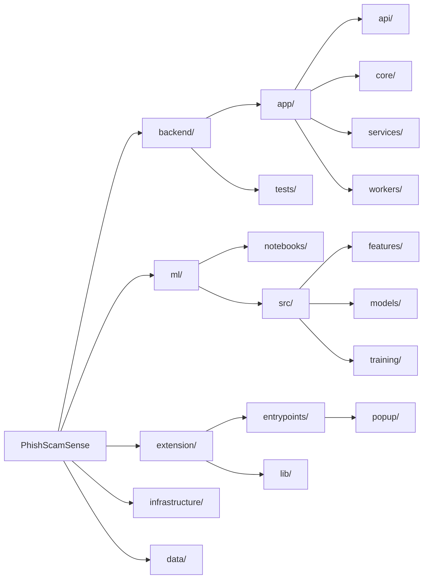

# PhishScamSense

Real-time phishing and malware URL detection via a browser extension backed by a local ML inference service.

## Overview

PhishScamSense detects phishing, malware, and spam URLs as you browse using a 4-class XGBoost classifier (benign / phishing / malware / spam) trained on the CIC-Bell-DNS2021 dataset. The browser extension checks every navigation against a local FastAPI backend that runs fully on-device — no data leaves your machine.

**Key capabilities:**
- Real-time URL classification on every page load (< 50 ms per prediction)
- 88-feature analysis: URL lexical structure, page content (HTML DOM), external signals (DNS/WHOIS)
- Typosquatting detection against 257 known brands via Levenshtein distance
- Suspicious TLD, shortening service, punycode, and IP-in-hostname detection
- Content-based signals when page HTML is available: external forms, null iframes, JS popups, unsafe anchors
- Local Bloom Filter for instant known-bad URL lookup without a network call

---

## Architecture



### Request flow

```
Browser navigation
      │
      ▼
Extension (background.ts)
  ├─ Bloom Filter hit? ──► Block immediately
  └─ POST /api/v1/predict { url, html? }
              │
              ▼
       FastAPI Backend
              │
              ▼
       MLPredictor.predict()
        ├─ extract_features()   ← 88 features (URL + content + external)
        └─ XGBoost Booster.predict()
              │
              ▼
       { phishing, confidence, label, threat_type }
              │
      Extension shows warning / blocks page
```

---

## Project Structure

```
PhishScamSense/
├── backend/                  FastAPI inference service
│   ├── app/
│   │   ├── api/routes/       REST endpoints (predict, reports, threats)
│   │   ├── core/             Config, lifespan, middleware
│   │   ├── schemas/          Pydantic request/response models
│   │   ├── services/         ml_predictor.py — model loading & inference
│   │   └── workers/          Celery async tasks
│   ├── tests/                pytest test suite
│   └── requirements.txt
│
├── ml/
│   ├── exports/              Active model files (xgb_classifier.json, etc.)
│   ├── notebooks/            Exploratory analysis
│   └── src/
│       ├── data/             data_loader.py — CIC-Bell-DNS2021 ingestion
│       ├── features/
│       │   ├── url_features.py       57 URL-only features
│       │   ├── content_features.py   24 HTML DOM features
│       │   ├── external_features.py  7 DNS/WHOIS/HTTP features
│       │   └── feature_extractor.py  Combined 88-feature extractor
│       ├── models/           fusion_model.py, nlp_branch.py (optional neural)
│       └── training/         train.py — XGBoost and neural training pipelines
│
├── extension/                WXT (Vite) browser extension
│   ├── entrypoints/
│   │   ├── background.ts     Service worker — intercepts navigations
│   │   └── popup/            React UI popup
│   └── lib/                  Bloom filter, API client utilities
│
├── data/
│   ├── raw/                  CIC-Bell-DNS2021 CSVs + validation.csv
│   └── processed/
│
├── infrastructure/
│   └── airflow/              DAGs for scheduled retraining
│
├── scripts/
│   ├── allbrands.txt         257 known brand names for typosquatting detection
│   ├── url_features.py       Reference implementation (Hannousse 2021)
│   ├── content_features.py
│   └── external_features.py
│
└── docs/
    ├── prd                   Product Requirements Document
    └── architecture.md       Mermaid architecture diagrams
```

---

## Tech Stack

| Layer | Technology |
|---|---|
| Browser Extension | WXT Framework (Vite) + React + TypeScript + TailwindCSS |
| API | FastAPI + Pydantic + Uvicorn |
| ML Inference | XGBoost (Booster, JSON format) |
| Feature Extraction | tldextract (PSL), BeautifulSoup4, python-whois |
| Task Queue | Celery + Redis |
| Training Dataset | CIC-Bell-DNS2021 (benign / phishing / malware / spam) |
| MLOps (planned) | MLflow + Apache Airflow |

---

## Feature Engineering

The classifier uses **88 features** grouped into three modules:

### URL features (57) — `ml/src/features/url_features.py`
Computed from the **hostname only** (path and query are excluded to prevent training/inference distribution mismatch).

| Group | Features | Count |
|---|---|---|
| Character counts | url_length, count_at, count_dollar, count_semicolumn, count_space, count_and, count_equal, count_percentage, count_question, count_colon, count_star, count_or, count_tilde, count_http_token, count_comma | 15 |
| Path-level | path_length, num_slashes, phish_hints_count, brand_in_path, has_path_extension, has_double_slash_redirect | 6 |
| Hostname numeric | hostname_length, num_dots, num_hyphens, num_underscores, num_digits_host, ratio_digits_host, num_digits_url, ratio_digits_url, url_entropy, hostname_entropy | 10 |
| Structural flags | has_ip_address, has_punycode, has_port, has_https, has_at_symbol, is_shortening_service, has_prefix_suffix, has_tld_in_path, has_tld_in_subdomain, has_abnormal_subdomain, has_suspicious_tld, char_repeat_count | 12 |
| Linguistic | consecutive_consonants_max, vowel_ratio, num_special_chars, has_statistical_report | 4 |
| Word-based | num_words, avg_word_length, max_word_length, min_word_length, subdomain_count | 5 |
| Brand / typosquatting | tld_length, domain_in_brand_exact, typosquatting_min_dist, typosquatting_suspicious, brand_in_subdomain | 5 |

### Content features (24) — `ml/src/features/content_features.py`
Extracted from raw HTML when provided by the browser extension. Default to 0 for URL-only analysis.

Internal/external hyperlink ratios, external CSS count, login form detection, external favicon, iframe visibility, JS popup/onmouseover/right-click disabling, empty title, domain-not-in-title, domain-not-in-copyright, form submission targets.

### External features (7) — `ml/src/features/external_features.py`
DNS record presence, domain age (days), registration length (days), WHOIS registered, redirect count, has_redirect, has_external_redirect. Disabled during training; enabled at inference.

---

## Setup

### Prerequisites
- Python 3.11+
- Node.js 18+ (for extension)
- Redis (for Celery, optional)

### Backend

```bash
cd backend
python -m venv ../venv
source ../venv/Scripts/activate   # Windows: ..\venv\Scripts\activate
pip install -r requirements.txt
uvicorn app.main:app --reload --host 0.0.0.0 --port 8000
```

### Training

```bash
# Download CIC-Bell-DNS2021 CSVs into data/raw/
# Files needed: benign_domains.csv, phishing_domains.csv, malware_domains.csv, spam_domains.csv

# Fast balanced training (recommended)
python -m ml.src.training.train \
  --mode xgboost \
  --data-dir data/raw \
  --output-dir ml/exports \
  --samples-per-class 16000

# Full dataset training
python -m ml.src.training.train \
  --mode xgboost \
  --data-dir data/raw \
  --output-dir ml/exports
```

Trained model is saved to `ml/exports/xgb_classifier.json` and loaded automatically by the backend on startup.

### Browser Extension

```bash
cd extension
npm install
npm run dev     # development with HMR
npm run build   # production build
```

Load the `extension/.output/chrome-mv3/` directory as an unpacked extension in Chrome.

---

## API

### `POST /api/v1/predict`

**Request:**
```json
{
  "url": "https://example.com/page",
  "html": "<html>...</html>"   // optional — enables content features
}
```

**Response:**
```json
{
  "phishing": false,
  "confidence": 0.98,
  "label": 0,
  "threat_type": "benign",
  "features": { ... }
}
```

Labels: `0` = benign, `1` = phishing, `2` = malware, `3` = spam.  
`phishing: true` for any non-benign label.

---

## Testing

```bash
cd backend
pytest tests/ -v
```

The test suite covers:
- `test_ml_predictor.py` — feature extraction (57 features), MLPredictor init/predict, singleton helpers
- `test_validation.py` — end-to-end accuracy report against `data/raw/validation.csv`

---

## Model Performance

Current model (`xgb_classifier.json`, trained on full CIC-Bell-DNS2021):

| Class | Precision | Recall | F1 |
|---|---|---|---|
| benign | 0.97 | 1.00 | 0.98 |
| phishing | 0.88 | 0.41 | 0.56 |
| malware | 0.76 | 0.95 | 0.84 |
| spam | 0.88 | 0.80 | 0.84 |
| **accuracy** | | | **0.91** |

Note: Phishing recall is limited because many PhishTank samples are hacked legitimate sites, distinguishable only by page content — not URL structure. Content features (when HTML is provided by the extension) are expected to significantly improve phishing recall.

---

## Roadmap

- [ ] Extension sends page HTML to backend for content-feature-based classification
- [ ] Scheduled Airflow DAG for weekly model retraining on fresh threat feeds
- [ ] MLflow experiment tracking integration
- [ ] VirusTotal / Google Safe Browsing API validation for false positive reports
- [ ] Neural pipeline (DistilBERT + BiLSTM fusion) for URL sequence analysis
