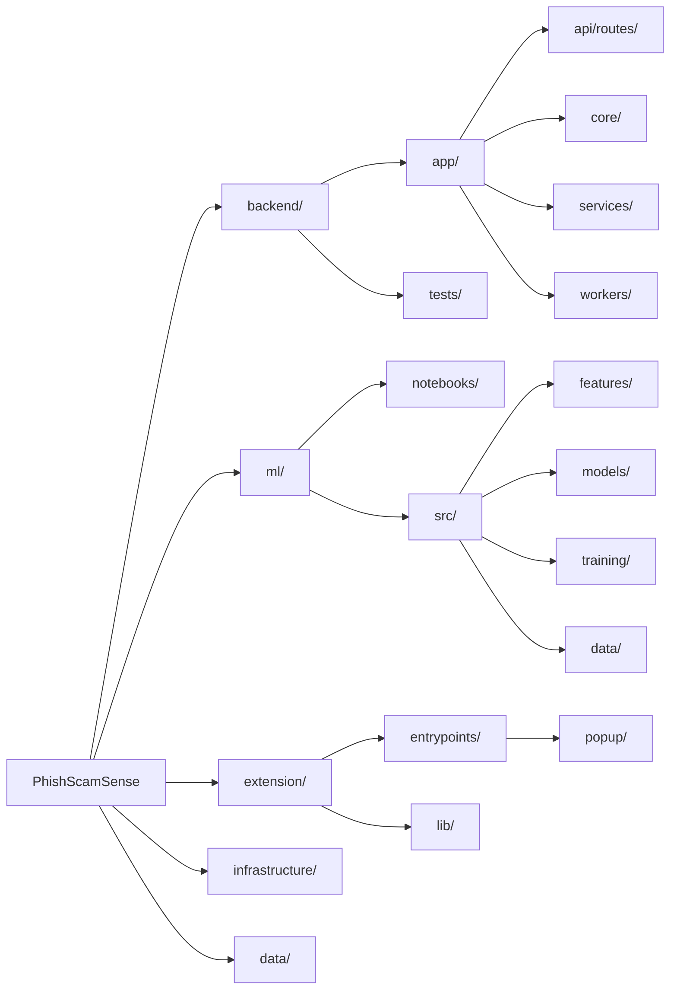

# PhishScamSense

Real-time phishing and scam URL detection via a browser extension backed by a hybrid multimodal AI inference service.

## Overview

PhishScamSense detects phishing, malware, and spam URLs as you browse using a **Multimodal Fusion Architecture** — combining a Deep Learning NLP pipeline (DistilBERT + BiLSTM + Attention) with classical feature engineering, both feeding into an XGBoost final classifier. The browser extension checks every navigation against a self-hosted FastAPI backend.

**Key capabilities:**
- Real-time 4-class URL classification on every page load (benign / phishing / malware / spam)
- Hybrid inference: deep semantic URL embeddings fused with 88 hand-engineered features
- Domain allowlist — 585+ trusted domain labels + 46 institutional TLD suffix patterns (`.ac.id`, `.go.id`, `.edu`, `.gov`) bypass ML for instant benign response
- Typosquatting detection against 257 known brands via Levenshtein distance
- Content-based signals when page HTML is available: external forms, null iframes, JS popups, unsafe anchors
- False positive reporting API with user feedback loop

---

## Model Architecture

PhishScamSense uses a **Hierarchical Multimodal Fusion** approach. Two parallel branches process different representations of the same URL, and their outputs are concatenated into a unified embedding before a final XGBoost classifier makes the prediction.

```
                        URL string
                            │
            ┌───────────────┴───────────────┐
            │                               │
     NLP Branch                    Numerical Branch
  (DistilBERT + BiLSTM             (MLP: 23 lexical
     + Attention)                   features → 64-dim)
         │                                  │
    128-dim embedding               64-dim embedding
            │                               │
            └───────────────┬───────────────┘
                            │
                  Concatenate (192-dim)
                            │
                    XGBoost Booster
                    (4-class classifier)
                            │
              benign / phishing / malware / spam
```

### NLP Branch — `ml/src/models/nlp_branch.py`

Processes the raw URL string as a sequence of tokens to capture **semantic and contextual patterns**:

1. **DistilBERT** (`distilbert-base-uncased`) — tokenizes the URL and produces a 768-dim contextual embedding per token. BERT weights are frozen during training; only downstream layers are fine-tuned.
2. **BiLSTM** (2 layers, 256 hidden units, bidirectional) — processes the token sequence to capture sequential dependencies across the URL structure.
3. **Attention Layer** — soft-weights each token position so the model learns to focus on suspicious substrings (e.g. brand names in unexpected positions, unusual TLDs).
4. **FC Layer** — projects the attended 512-dim BiLSTM output down to a **128-dim semantic embedding**.

### Numerical Branch — `ml/src/models/numerical_branch.py`

Processes **23 hand-crafted lexical and structural features** through a Multi-Layer Perceptron:

- Architecture: `Linear(23→128) → BN → ReLU → Dropout → Linear(128→64) → BN → ReLU → Dropout → Linear(64→64)`
- Captures structural signals the NLP branch cannot infer from token sequences alone: entropy, digit ratios, subdomain depth, typosquatting distance, etc.
- Output: **64-dim numerical embedding**

> The codebase also includes a `CapsNetBranch` alternative for the numerical branch — Capsule Neural Networks preserve the spatial hierarchy of structural features. The MLP branch is used in the current production model.

### Fusion & Classification

The 128-dim NLP embedding and 64-dim numerical embedding are **concatenated** into a single **192-dim fused vector**. This vector is then fed into an **XGBoost Booster** (`multi:softmax`, 4 classes) which acts as the final decision layer.

This design deliberately separates representation learning (neural networks) from classification (gradient-boosted trees), combining the strengths of both: deep learning captures semantic URL patterns that hand-crafted features miss, while XGBoost provides interpretable, robust classification with fast inference.

### Inference Modes

The backend supports two modes depending on available model files in `ml/exports/`:

| Mode | Condition | Pipeline |
|------|-----------|----------|
| **Neural (default)** | `fusion_model.pt` present | DistilBERT → BiLSTM → Attention → MLP → Concat → XGBoost |
| **XGBoost-only fallback** | `fusion_model.pt` absent | 88-feature vector → XGBoost directly |

---

## Architecture



### Request Flow

```
Browser navigation
      │
      ▼
Extension (background.ts)
  └─ POST /api/v1/predict { url, html? }
              │
              ▼
       FastAPI Backend
              │
              ├─ Allowlist check  ──────────────────────► benign immediately
              │
              ▼
       MLPredictor.predict()
        │
        ├─ [Neural mode]
        │   ├─ URLTokenizer → DistilBERT → BiLSTM → Attention  → 128-dim
        │   ├─ extract_features(url) → 23 lexical features → MLP → 64-dim
        │   └─ Concat(128 + 64) → 192-dim fused vector → XGBoost
        │
        └─ [XGBoost-only fallback]
            └─ extract_features(url, html) → 88 features → XGBoost
              │
              ▼
       { phishing, confidence, label, threat_type }
              │
      Extension shows warning / blocks page
```

---

## Tech Stack

| Layer | Technology |
|---|---|
| Browser Extension | WXT Framework (Vite) + React + TypeScript + TailwindCSS |
| API | FastAPI + Pydantic + Uvicorn |
| NLP Branch | DistilBERT (`distilbert-base-uncased`) + BiLSTM + Attention |
| Numerical Branch | MLP (Multi-Layer Perceptron) / CapsNet |
| Final Classifier | XGBoost Booster (JSON format, `multi:softmax`) |
| Feature Extraction | tldextract (PSL), BeautifulSoup4, python-whois |
| Training Dataset | CIC-Bell-DNS2021 (benign / phishing / malware / spam) |
| MLOps (planned) | MLflow + Apache Airflow |
| Message Broker | RabbitMQ + Celery |

---

## Project Structure

```
PhishScamSense/
├── backend/                  FastAPI inference service
│   ├── app/
│   │   ├── api/routes/       predict.py, reports.py, threats.py
│   │   ├── core/             config.py, lifespan, middleware
│   │   ├── schemas/          Pydantic request/response models
│   │   ├── services/         ml_predictor.py — model loading & inference
│   │   └── workers/          Celery stubs (future async tasks)
│   ├── tests/                pytest test suite
│   ├── Dockerfile            Development image
│   └── Dockerfile.prod       Production image (project-root build context)
│
├── ml/
│   ├── exports/              Active model files (fusion_model.pt, xgb_classifier.json, etc.)
│   ├── notebooks/            Exploratory analysis
│   └── src/
│       ├── data/             data_loader.py — CIC-Bell-DNS2021 ingestion + augmentation
│       ├── features/
│       │   ├── url_features.py         57 URL-only lexical features
│       │   ├── content_features.py     24 HTML DOM features
│       │   ├── external_features.py    7 DNS/WHOIS/HTTP features
│       │   ├── feature_extractor.py    Combined 88-feature entry point
│       │   └── whitelist.py            Domain allowlist (585 labels + 46 TLD suffixes)
│       ├── models/
│       │   ├── nlp_branch.py           DistilBERT + BiLSTM + Attention
│       │   ├── numerical_branch.py     MLP / CapsNet numerical branch
│       │   └── fusion_model.py         Hierarchical fusion + XGBoost classifier
│       └── training/         train.py — fusion model + XGBoost training pipeline
│
├── extension/                WXT (Vite) browser extension
│   ├── entrypoints/
│   │   ├── background.ts     Service worker — intercepts navigations
│   │   └── popup/            React UI popup
│   └── lib/                  Bloom filter, API client utilities
│
├── data/
│   ├── raw/                  CIC-Bell-DNS2021 CSVs + validation.csv (gitignored)
│   ├── processed/            (gitignored)
│   └── reports/              false_positives.jsonl — user-submitted reports (gitignored)
│
├── infrastructure/
│   └── airflow/              DAGs for scheduled retraining (planned)
│
└── docs/
    ├── prd                   Product Requirements Document
    └── architecture.md       Architecture diagrams
```

---

## Feature Engineering

The XGBoost-only fallback uses **88 features** grouped into three modules. In neural mode, only the 23 lexical features are passed to the MLP numerical branch (content and external features are not used as the NLP branch handles semantic context).

### URL features (57) — `ml/src/features/url_features.py`

| Group | Features | Count |
|---|---|---|
| Character counts | url_length, count_at, count_dollar, count_semicolumn, count_space, count_percentage, count_colon, count_star, count_or, count_tilde, count_http_token, count_comma, count_and, count_equal, count_question | 15 |
| Path-level | path_length, num_slashes, phish_hints_count, brand_in_path, has_path_extension, has_double_slash_redirect | 6 |
| Hostname numeric | hostname_length, num_dots, num_hyphens, num_underscores, num_digits_host, ratio_digits_host, num_digits_url, ratio_digits_url, url_entropy, hostname_entropy | 10 |
| Structural flags | has_ip_address, has_punycode, has_port, has_https, has_at_symbol, is_shortening_service, has_prefix_suffix, has_tld_in_path, has_tld_in_subdomain, has_abnormal_subdomain, has_suspicious_tld, char_repeat_count | 12 |
| Linguistic | consecutive_consonants_max, vowel_ratio, num_special_chars, has_statistical_report | 4 |
| Word-based | num_words, avg_word_length, max_word_length, min_word_length, subdomain_count | 5 |
| Brand / typosquatting | tld_length, domain_in_brand_exact, typosquatting_min_dist, typosquatting_suspicious, brand_in_subdomain | 5 |

### Content features (24) — `ml/src/features/content_features.py`
Extracted from raw HTML when provided by the browser extension. Default to 0 for URL-only analysis.

Internal/external hyperlink ratios, external CSS count, login form detection, external favicon, iframe visibility, JS popup/onmouseover/right-click disabling, empty title, domain-not-in-title, domain-not-in-copyright, form submission targets.

### External features (7) — `ml/src/features/external_features.py`
DNS record presence, domain age (days), registration length (days), WHOIS registered, redirect count, has_redirect, has_external_redirect. Disabled during training; enabled at inference optionally.

---

## Setup

### Prerequisites
- Python 3.11+
- Node.js 18+ (for extension)

### Backend

```bash
cd backend
python -m venv ../venv
source ../venv/Scripts/activate   # Windows: ..\venv\Scripts\activate
pip install -r requirements.txt
uvicorn app.main:app --reload --host 0.0.0.0 --port 8000
```

### Training

The training pipeline supports two modes:

```bash
# XGBoost-only (fast, no GPU required)
python -m ml.src.training.train \
  --mode xgboost \
  --data-dir data/raw \
  --output-dir ml/exports \
  --samples-per-class 16000

# Full neural fusion (DistilBERT + XGBoost, GPU recommended)
python -m ml.src.training.train \
  --mode fusion \
  --data-dir data/raw \
  --output-dir ml/exports \
  --samples-per-class 16000
```

Trained model files saved to `ml/exports/`:
- `fusion_model.pt` — PyTorch fusion model weights (NLP + MLP branches)
- `xgb_classifier.json` — XGBoost Booster (trained on fused embeddings)

### Browser Extension

```bash
cd extension
npm install
npm run dev     # development with HMR
npm run build   # production build
```

Load the `extension/.output/chrome-mv3/` directory as an unpacked extension in Chrome.

---

## API

### `POST /api/v1/predict`

**Request:**
```json
{
  "url": "https://example.com/page",
  "html": "<html>...</html>"
}
```
`html` is optional — enables 24 content-based features when provided by the extension.

**Response:**
```json
{
  "phishing": false,
  "confidence": 0.98,
  "label": 0,
  "threat_type": "benign",
  "features": { ... }
}
```

Labels: `0` = benign, `1` = phishing, `2` = malware, `3` = spam.  
`phishing: true` for any non-benign label.  
`features` is empty `{}` for allowlisted domains (fast path, no ML inference).

### `POST /api/v1/reports/false-positive`

**Request:**
```json
{
  "url": "https://flagged-site.com",
  "comments": "This is my company intranet"
}
```

**Response:**
```json
{
  "id": "uuid",
  "status": "received",
  "message": "Report saved. We will review this URL and update our detection."
}
```

Reports are persisted to `data/reports/false_positives.jsonl`.

---

## Testing

```bash
cd backend
pytest tests/ -v
```

The test suite covers:
- `test_ml_predictor.py` — feature extraction, MLPredictor init/predict, singleton helpers
- `test_validation.py` — end-to-end accuracy report against `data/raw/validation.csv`

---

## Model Performance

Current model (`xgb_classifier.json` trained on fused 192-dim embeddings from CIC-Bell-DNS2021, balanced 16k/class):

| Class | Precision | Recall | F1 |
|---|---|---|---|
| benign | 0.96 | 0.99 | 0.98 |
| phishing | 0.99 | 0.94 | 0.97 |
| spam | 0.92 | 0.90 | 0.91 |
| **accuracy** | | | **0.98** |

---

## Roadmap

- [ ] Extension sends page HTML to backend for content-feature-based classification
- [ ] VirusTotal / Google Safe Browsing validation for false positive reports
- [ ] Scheduled Airflow DAG for weekly model retraining on fresh threat feeds
- [ ] MLflow experiment tracking integration
- [ ] CapsNet numerical branch as alternative to MLP
