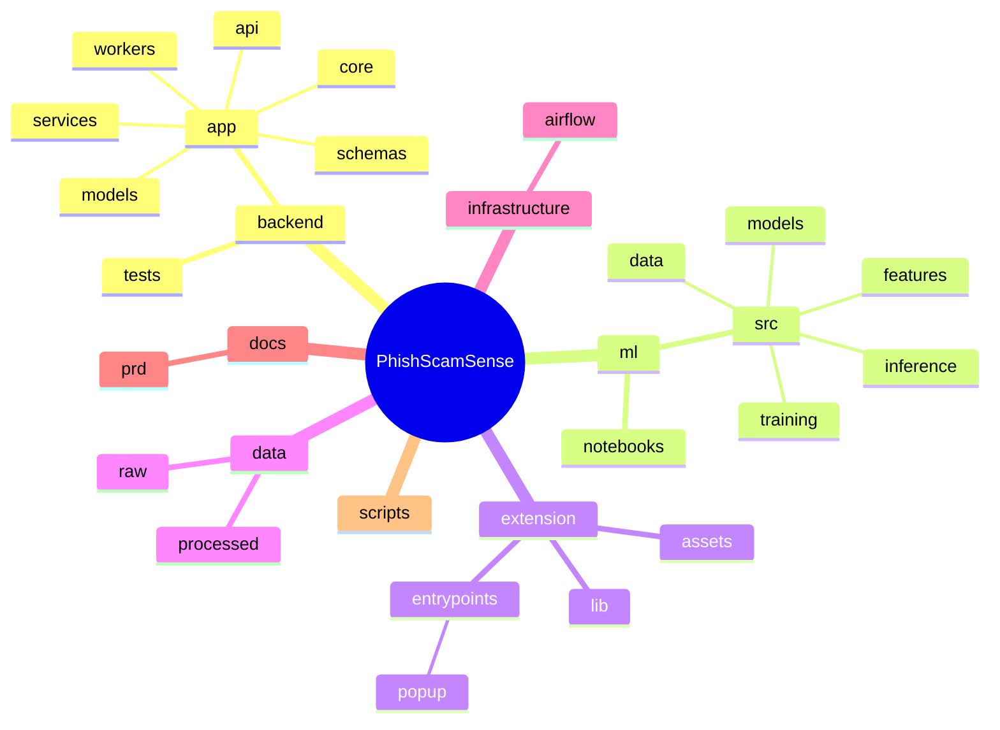
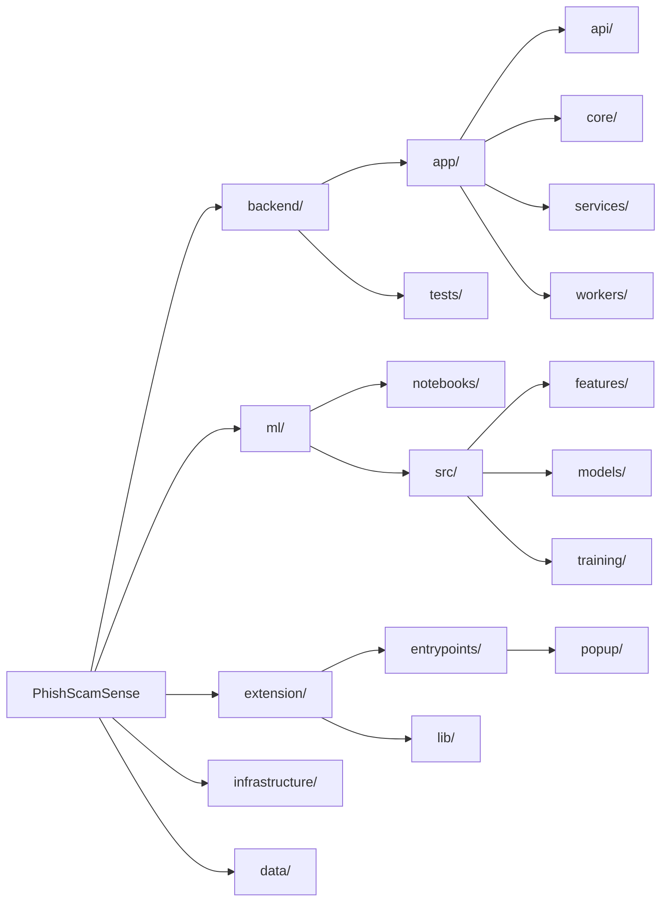

# PhishScamSense Architecture

Here are the Mermaid diagrams representing the high-level architecture and directory structure of the PhishScamSense project.

## Mindmap Representation

## Flowchart Representation

