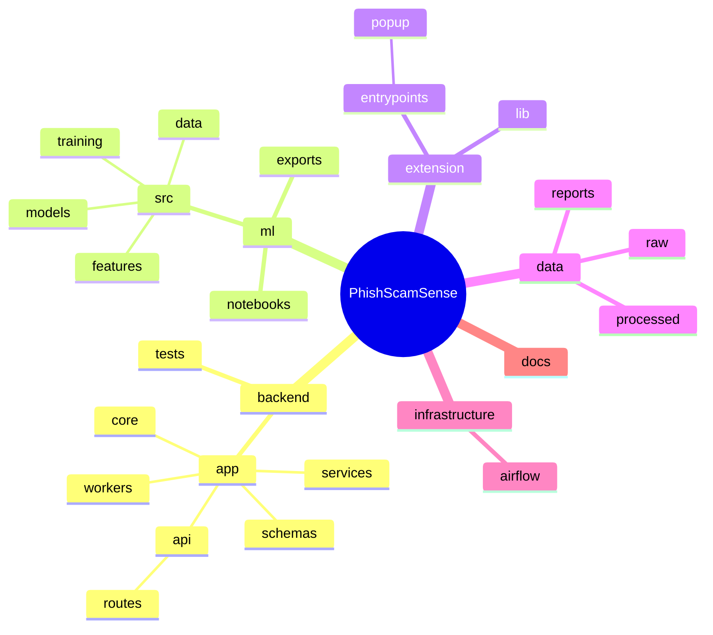
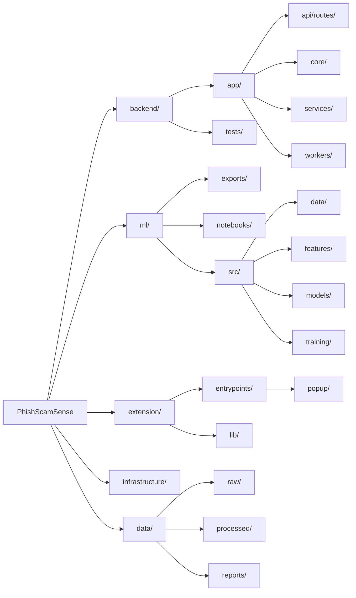
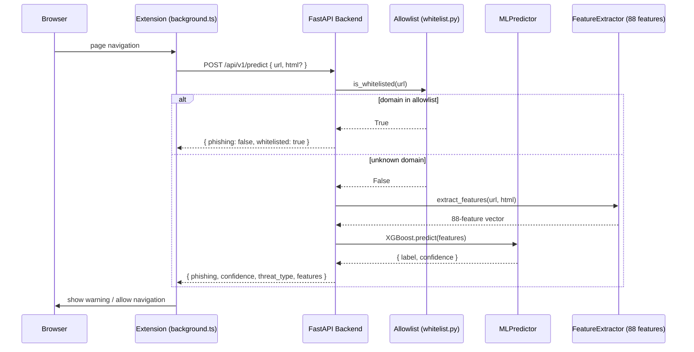
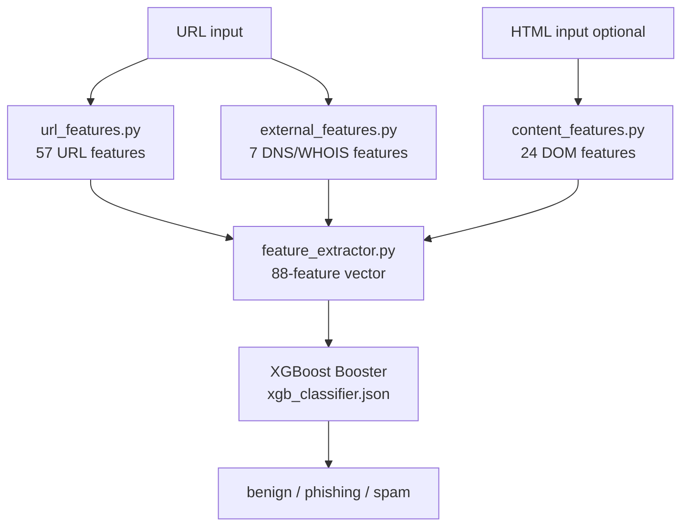

# PhishScamSense Architecture

## Directory Structure

```mermaid
mindmap
  root((PhishScamSense))
    backend
      app
        api
          routes
        core
        schemas
        services
        workers
      tests
    ml
      exports
      notebooks
      src
        data
        features
        models
        training
    extension
      entrypoints
        popup
      lib
    data
      raw
      processed
      reports
    infrastructure
      airflow
    docs
```

## Component Flowchart

```mermaid
graph LR
    Root[PhishScamSense] --> Backend[backend/]
    Root --> ML[ml/]
    Root --> Ext[extension/]
    Root --> Infra[infrastructure/]
    Root --> Data[data/]

    Backend --> B_App[app/]
    Backend --> B_Tests[tests/]
    B_App --> B_Api[api/routes/]
    B_App --> B_Core[core/]
    B_App --> B_Services[services/]
    B_App --> B_Workers[workers/]

    ML --> M_Exports[exports/]
    ML --> M_Notebooks[notebooks/]
    ML --> M_Src[src/]
    M_Src --> M_Data[data/]
    M_Src --> M_Features[features/]
    M_Src --> M_Models[models/]
    M_Src --> M_Training[training/]

    Ext --> E_Entry[entrypoints/]
    Ext --> E_Lib[lib/]
    E_Entry --> E_Popup[popup/]

    Data --> D_Raw[raw/]
    Data --> D_Processed[processed/]
    Data --> D_Reports[reports/]
```

## Request Flow

```mermaid
sequenceDiagram
    participant B as Browser
    participant Ext as Extension (background.ts)
    participant API as FastAPI Backend
    participant WL as Allowlist (whitelist.py)
    participant ML as MLPredictor
    participant FE as FeatureExtractor (88 features)

    B->>Ext: page navigation
    Ext->>API: POST /api/v1/predict { url, html? }
    API->>WL: is_whitelisted(url)
    alt domain in allowlist
        WL-->>API: True
        API-->>Ext: { phishing: false, whitelisted: true }
    else unknown domain
        WL-->>API: False
        API->>FE: extract_features(url, html)
        FE-->>API: 88-feature vector
        API->>ML: XGBoost.predict(features)
        ML-->>API: { label, confidence }
        API-->>Ext: { phishing, confidence, threat_type, features }
    end
    Ext->>B: show warning / allow navigation
```

## Feature Extraction Pipeline

```mermaid
graph TD
    URL[URL input] --> UF[url_features.py<br/>57 URL features]
    HTML[HTML input optional] --> CF[content_features.py<br/>24 DOM features]
    URL --> EF[external_features.py<br/>7 DNS/WHOIS features]

    UF --> FE[feature_extractor.py<br/>88-feature vector]
    CF --> FE
    EF --> FE

    FE --> XGB[XGBoost Booster<br/>xgb_classifier.json]
    XGB --> OUT[benign / phishing / spam]
```
